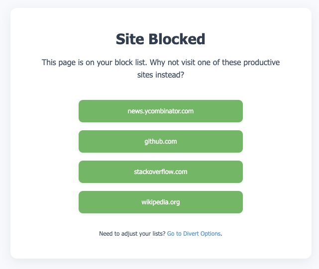

# divert
A Chrome extension to block distracting websites and redirect to a page with productive alternatives

## Installation Instructions

Follow these steps to install the divert extension in your Chrome browser:

1.  **Download the Code:** On the main page of this GitHub repository, click the green '<> Code' button, then select 'Download ZIP'. Save the ZIP file to your computer.

2.  **Extract the Files:** Locate the downloaded ZIP file and extract its contents into a dedicated folder. Remember where you create this folder.

3.  **Open Extensions Page:** Launch Google Chrome, type `chrome://extensions` into the address bar, and press Enter.

4.  **Enable Developer Mode:** On the Extensions page, find the 'Developer mode' toggle switch (usually in the top-right corner) and make sure it is switched ON.

5.  **Load the Extension:** Click the 'Load unpacked' button that appears (often near the top-left).

6.  **Select the Folder:** A file selection dialogue will open. Navigate to and select the folder where you **extracted** the extension files in step 2 (this folder should directly contain the `manifest.json` file). Click 'Select Folder'.

7.  **Complete:** The divert extension should now appear in your list of installed extensions and be active. You can manage its settings by clicking its icon in the browser toolbar or via the `chrome://extensions` page.